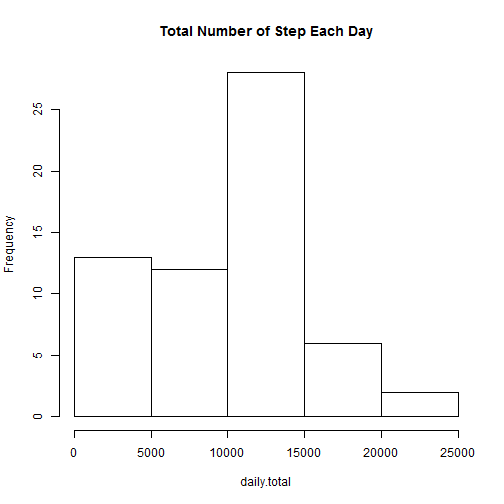
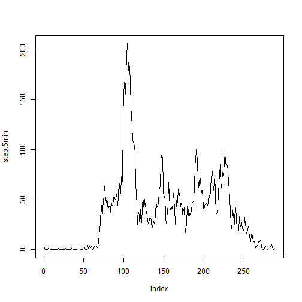
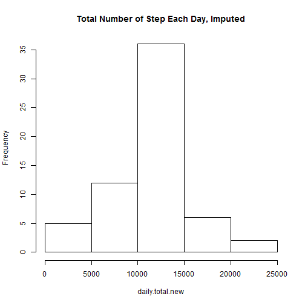
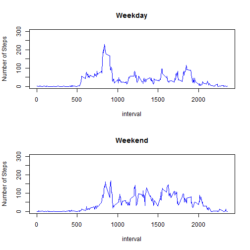

## Loading and reprocessing data


```r
mydata <- read.csv("activity.csv")
dim(mydata)
```

```
## [1] 17568     3
```

```r
str(mydata)
```

```
## 'data.frame':	17568 obs. of  3 variables:
##  $ steps   : int  NA NA NA NA NA NA NA NA NA NA ...
##  $ date    : Factor w/ 61 levels "2012-10-01","2012-10-02",..: 1 1 1 1 1 1 1 1 1 1 ...
##  $ interval: int  0 5 10 15 20 25 30 35 40 45 ...
```

```r
mydata$date <- as.Date(mydata$date)
```

## Mean total number of steps taken per day


```r
daily.total <- tapply(mydata$steps, mydata$date, sum, na.rm = TRUE)
hist(daily.total, main = "Total Number of Step Each Day")
```



Mean total number of steps:

```r
mean(daily.total)
```

```
## [1] 9354.23
```
Median total number of steps:

```r
median(daily.total)
```

```
## [1] 10395
```

## Average daily activity pattern

Time series plot of 5-minute steps averaged across all days

```r
step.5min <- tapply(mydata$steps, mydata$interval, mean, na.rm = TRUE)
plot(step.5min, type = "l")
```



Which 5-minute interval contains the max number steps?

```r
names(which.max(step.5min))
```

```
## [1] "835"
```

## Imputing missing values

Total number of missing values:

```r
sum(is.na(mydata$steps))
```

```
## [1] 2304
```

Imputing missing values using mean for that 5-min interval

```r
days <- length(unique(mydata$date))
step.5min.rep <- rep(step.5min, days)
missing <- is.na(mydata$steps)
mydata.impute <- mydata
mydata.impute$steps[missing] <- step.5min.rep[missing]
```

Histogram of newly imputed data:

```r
daily.total.new <- tapply(mydata.impute$steps, mydata.impute$date, sum)
hist(daily.total.new, main = "Total Number of Step Each Day, Imputed")
```



Mean and median total steps after impute

```r
mean(daily.total.new)
```

```
## [1] 10766.19
```

```r
median(daily.total.new)
```

```
## [1] 10766.19
```

These numbers are different from the first part of the assignment. 
Both mean and median are higher. Histogram, mean and median values suggest that the distibution is closer to normal distribution. 

## Differences in activity between weekdays and weekends

Create a new variable "weekday" or "weekend"

```r
weekdays1 <- c('Monday', 'Tuesday', 'Wednesday', 'Thursday', 'Friday')
mydata.impute$wDay <- factor((weekdays(mydata.impute$date) %in% weekdays1), 
         levels=c(FALSE, TRUE), labels=c('weekend', 'weekday'))
```
A panel plot comparing weedday vs weekend activities

```r
mydata.weekday <- mydata.impute[mydata.impute$wDay == 'weekday', ]
mydata.weekend <- mydata.impute[mydata.impute$wDay == 'weekend', ]
ave.weekday <- tapply(mydata.weekday$steps, mydata.weekday$interval, mean)
ave.weekend <- tapply(mydata.weekend$steps, mydata.weekend$interval, mean)
interval <- unique(mydata.weekend$interval)
par(mfrow = c(2,1))
plot(interval, ave.weekday, type = "l", ylim = c(0,300), col="blue",
     ylab = "Number of Steps", main = "Weekday")
plot(interval, ave.weekend, type = "l", ylim = c(0,300), col="blue",
     ylab = "Number of Steps", main = "Weekend")
```




